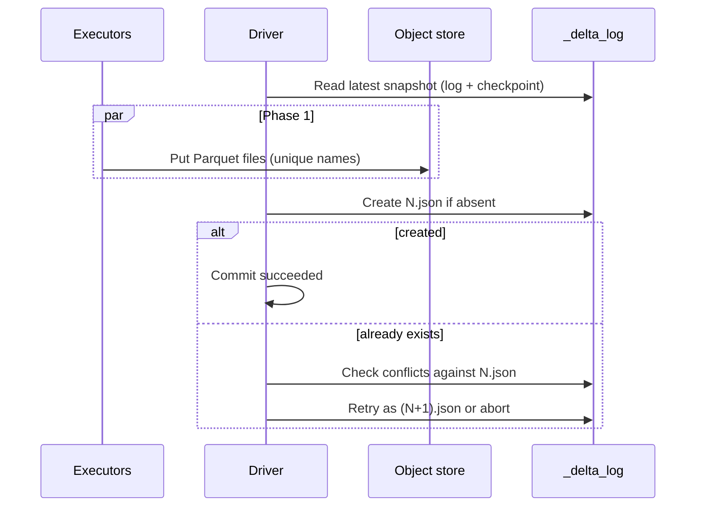

# Commit protocol

A Delta write is not "write Parquet and hope." It is a two-phase protocol whose second phase is a single atomic filesystem (or catalog) create. The [VLDB 2020 paper](https://www.vldb.org/pvldb/vol13/p3411-armbrust.pdf) describes it as: read the latest log record, write new data objects, then create log record `r+1`. Spark's public docs split the same work into read / write / validate-and-commit. Both are the same machine.

## Phase 1: stage data

Executors write Parquet files to the table path. This is the parallel, expensive part. The files have unique names (UUID in the filename). Nothing in `_delta_log/` has changed, so no reader can see them.

For a blind append, phase 1 does not even need a consistent snapshot of the data. The writer still needs to know the *next version number* and the current protocol/schema, so it reads the log, but it does not rewrite existing files.

For `UPDATE`, `DELETE`, `MERGE`, or `overwrite`, phase 1 has more work. The writer reads the latest snapshot, finds the files that overlap the predicate, writes replacement Parquet, and prepares a mix of `add` and `remove` actions. The old files stay on disk, still live, until phase 2.

Failed jobs die here all the time. The orphan Parquet is harmless. It is not in the log.

## Phase 2: publish the JSON

The driver (more precisely, the process running `OptimisticTransaction.commit`) serializes the actions and asks the `LogStore` to write

```text
_delta_log/00000000000000000012.json
```

with overwrite disabled. That is "create if absent":

- If the object did not exist, the write succeeds. Version 12 is committed. The table has a new snapshot. Done.
- If the object already existed, the store throws `FileAlreadyExistsException`. Another writer took 12. This writer does **not** overwrite. It goes to conflict checking ([next page](04-optimistic-concurrency.md)).

There is no distributed two-phase commit across executors. The Parquet writes are not transactional. The JSON create is. Atomicity of a Delta commit is exactly the atomicity of that one create.



## What "atomic create if absent" actually is

The protocol requires: writers must never overwrite an existing log entry, and should use the storage primitive that makes that true under concurrency.

| Storage | Primitive |
| --- | --- |
| HDFS, Azure Data Lake | Write to a temp path, `rename(src, dest)` that fails if `dest` exists |
| GCS, Azure Blob | Native put-if-absent |
| S3, single Spark driver | In-memory coordination inside one JVM. Safe for concurrent jobs on *that* cluster. Not safe across clusters. |
| S3, multiple clusters | `S3DynamoDBLogStore`: `PutItem` a version key in DynamoDB (atomic if-not-exists), then write the JSON. DynamoDB is the mutex; S3 holds the bytes. |
| Catalog-managed tables | Write `_delta_log/_staged_commits/{version}.{uuid}.json` (or send the bytes inline). The catalog ratifies a winner and later publishes it as `{version}.json`. |

S3's missing put-if-absent is the historical footgun. Two drivers that both `PutObject` `...012.json` can overwrite each other; the first commit vanishes. That is silent data loss, not a conflict exception. The DynamoDB log store exists to prevent it. Native S3 conditional writes (`If-None-Match: *`) can provide the same primitive; the Spark LogStore does not universally rely on them yet.

Local `file://` in a Spark demo behaves like HDFS-style rename. Two threads in one JVM are coordinated. Two separate processes on a Mac laptop writing the same path are in the same danger zone as naive S3.

## The commit is the JSON, not the Parquet

Once `012.json` exists, readers that refresh will see the new files. Readers that already hold an older snapshot keep seeing that snapshot until they ask for a new one. That is MVCC: every version is a consistent cut, identified by the highest JSON file the reader included.

There is no "commit complete" RPC. Checkpoints, CRC files, and `_last_checkpoint` are written *after* a successful commit, in `postCommit`. If the process dies between `012.json` landing and the checkpoint, the commit still happened. The next writer or reader will see `012.json` by listing the log.

## Version numbers are a total order

Commits are totally ordered by filename. That order *is* the history. Isolation arguments, streaming batch ids, and `DESCRIBE HISTORY` all hang off it. You cannot insert a commit between 11 and 12. You cannot have two different `012.json` files that both "won." You can only win 12, or lose 12 and try 13.

That is why phase 2 cannot be reordered across writers, and why streaming pipelining (phase 1 overlap) still commits in batch order. The next page is what happens when two writers want the same number.
