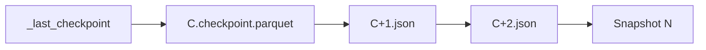

# Checkpoints and readers

Readers do not replay the entire JSON history. They jump to a checkpoint and apply only the tail. That is the whole reason a table with a million commits still opens in seconds.

## Reconstructing a snapshot

```text
1. Read _last_checkpoint → version C, and how many parts / bytes.
2. Load the checkpoint at C. This is the live file set, protocol,
   metadata, and txn map as of C. (Or list _delta_log and pick the
   newest checkpoint if the hint is missing or stale.)
3. Read C+1.json, C+2.json, … up to the newest version N.
4. Apply those actions on top of the checkpoint.
5. The result is snapshot N: the current table.
```

"Work backwards" in the sense that you start from the newest compact state and walk forward a short distance. You never start at version 0 unless there is no checkpoint yet.



The teaching reader in this repo does the same thing, minus Parquet checkpoints unless PyArrow is installed:

```bash
uv run delta-inspect examples/fixtures/txns snapshot 3
uv run delta-inspect examples/fixtures/txns snapshot 4
```

Version 3 has four live files. Version 4 has one. The code path is `_apply_commit` over JSON. Spark's `Snapshot` is that algorithm with caching, log-segment listing, and data-skipping stats already in memory.

## `_last_checkpoint`

A JSON object, not a commit:

```json
{
  "version": 10,
  "size": 4,
  "sizeInBytes": 12345,
  "numOfAddFiles": 1
}
```

`version` is which checkpoint to open. `size` is the number of actions in it. `parts` is set when the checkpoint was written as multiple Parquet files. The file is a hint: if it is missing or points at a checkpoint that is not there yet, the reader lists `_delta_log` and looks for `*.checkpoint.parquet` (and V2 UUID names). Writers overwrite this hint after a successful checkpoint; readers should not treat a broken hint as a corrupt table.

Spark will not load `_last_checkpoint` through `spark.read.json` if you point it at the table, because the name starts with `_`. Open it with a filesystem API, or with `delta-inspect`.

## When checkpoints are written

Table property `delta.checkpointInterval`, default **10**. After a successful commit of version `N > 0` where `N % interval == 0`, `postCommit` writes a checkpoint for `N`. So versions 10, 20, 30, … on a default table.

The interval is in *commits*, not minutes and not streaming batches. A quiet table checkpoints rarely. A streaming table that commits every second checkpoints every ten seconds at the default.

A checkpoint is not itself a commit. It does not bump the version. It must contain:

- current `protocol`
- current `metaData`
- every live `add`
- recent `remove` tombstones that `VACUUM` still needs
- the `txn` map
- `domainMetadata` that has not been removed

It must **not** contain `commitInfo` or `cdc`. Those stay in the JSON files.

## Checkpoint formats

Classic, the one you will see first:

```text
00000000000000000010.checkpoint.parquet
```

Each row is an action as a Parquet struct (`add`, `remove`, `metaData`, …). Two writers racing to produce the same classic checkpoint may overwrite each other; both snapshots should be equivalent, so readers can use either.

Multi-part (deprecated):

```text
00000000000000000010.checkpoint.0000000001.0000000003.parquet
00000000000000000010.checkpoint.0000000002.0000000003.parquet
00000000000000000010.checkpoint.0000000003.0000000003.parquet
```

These cannot be published atomically, so a crash can leave a mixed set of parts. V2 UUID checkpoints exist to replace them: a single `N.checkpoint.{uuid}.json` (or `.parquet`) plus sidecar Parquet files under `_delta_log/_sidecars/` that hold the `add`/`remove` rows. The UUID name is unique, so two writers do not clobber each other. Older readers that do not understand V2 still need the occasional classic checkpoint so they can read the protocol and fail cleanly.

## Listing the log

A reader does not `ls` the entire table directory. It lists `_delta_log` from a known version (the checkpoint, or 0) using the LogStore's `listFrom`. Object-store listing is the expensive metadata operation Delta is designed to avoid on the *data* files: instead of listing a million Parquet objects, you list a few dozen log objects and then open the files the snapshot names.

That is also why a Parquet file that no commit mentions is invisible. The reader never lists it.

## Time travel is the same algorithm

`SELECT * FROM txns VERSION AS OF 3` is "reconstruct snapshot 3." If a checkpoint exists at 0 or 10, pick the newest one `<= 3` and apply JSON up to 3. `TIMESTAMP AS OF` maps a timestamp onto a version via `commitInfo.timestamp` (or in-commit timestamps when that feature is on), then does the same.

Log cleanup (`delta.logRetentionDuration`, default 30 days) may delete JSON and checkpoints older than the cutoff. Time travel beyond that window fails. Data-file cleanup (`VACUUM`, `delta.deletedFileRetentionDuration`, default 7 days) may delete the Parquet that those old snapshots named. The two clocks are independent; the stricter one is what actually limits how far back you can go.

## CRC and integrity

After a commit, writers may also write a version checksum file. `_last_checkpoint` itself can carry an MD5 of its canonicalized JSON. These are guards against truncated or bit-flipped metadata. They are not part of snapshot replay. If you are reading the log by hand, you can ignore them until you are writing a production connector.
