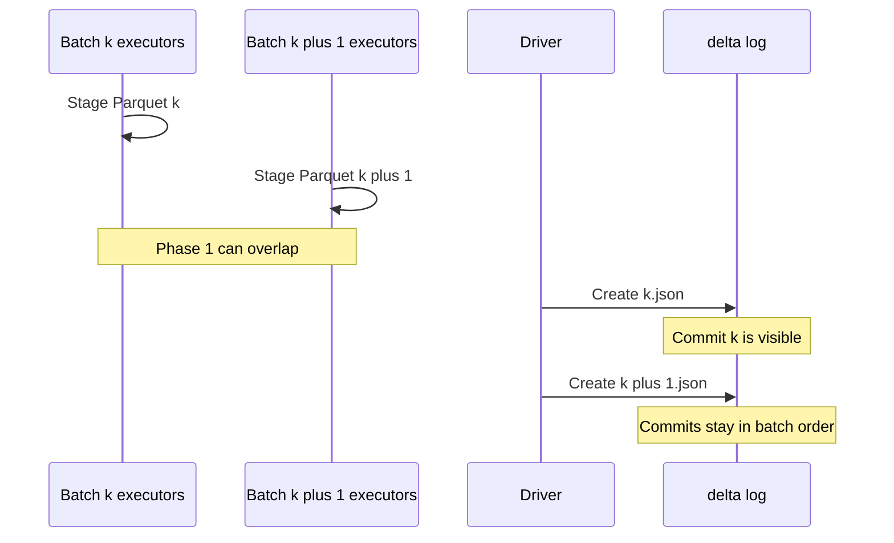

# Pipelining

The commit protocol has a slow phase and a fast phase. Phase 1 writes Parquet, in parallel, for as long as the data takes. Phase 2 creates one JSON object and, on collision, retries metadata. Those phases do not have to be 1:1 with "a micro-batch is in flight."

The [VLDB paper](https://www.vldb.org/pvldb/vol13/p3411-armbrust.pdf) calls the Parquet writes the staging of data objects: they are in the object store, they are not in the table. Staging is not a commit. That split is what lets a pipeline overlap work across batches.

## What can overlap

Phase 1 of batch `k+1` does not change the log. Readers still see batch `k` (or earlier). So executors may write batch `k+1`'s Parquet while the driver is still finishing batch `k`'s JSON, or while batch `k` is waiting out a conflict retry, or while the streaming engine is writing *its* offset commit.

Batch `k+1` must not publish `(k+1).json` before `k.json` exists. Versions are a total order. The streaming `txn.version` is the batch id; that too must increase. The engine can run the expensive part ahead. It cannot let commits leapfrog.

That is the tie-back: **data staging is phase 1, and phase 1 can overlap. The commit is phase 2, and phase 2 stays in batch order.**

## Why overlapping staging is safe

- Staged files have unique names. Batch `k+1` cannot clobber batch `k`'s Parquet.
- Uncommitted files are invisible. A reader that opened the table during the overlap still reconstructs from the last JSON that exists.
- If batch `k+1` dies after staging and before commit, its files are orphans, same as any failed write.
- If batch `k` dies after its JSON lands, batch `k+1`'s already-written Parquet is still usable: the retry of phase 2 just points `add` at those paths.

The unsafe thing is overlapping *commits* for the same query: two processes both trying to be batch `k`, or committing batch `k+1` first. The `txn` map and the create-if-absent version numbers are there to make that either retry or fail, not silently reorder.

## What Spark actually does today

Default Structured Streaming is stop-and-wait. `MicroBatchExecution` constructs a batch, runs it (including the Delta sink commit), records progress, then constructs the next. Phase 1 of batch `k+1` does **not** overlap phase 2 of batch `k` unless you opt into a pipelining feature.

Databricks' asynchronous progress tracking overlaps *offset checkpointing* with processing, and it is aimed at Kafka sinks; it also weakens exactly-once (offset ranges can change on failure). It is not the Delta commit pipeline, and it is not what this page is describing.

The useful mental model for Delta remains the paper's, not a specific Spark flag:

1. You *may* stage the next batch's files early. That is extra throughput when commit latency (object-store put-if-absent, conflict retries, checkpoint write) is large compared with executor time.
2. You *must* commit in order. The next JSON name is `last+1`. The next `txn.version` is `lastTxn+1` for that `appId`.
3. Exactly-once on replay still depends on the `txn` action landing in that ordered JSON, which is why `foreachBatch` has to set it by hand.

## For the `txns` pipeline

A writer that appends into `txns` can start uploading the next file as soon as the current file is closed, even if `_delta_log/00…02.json` has not been created yet. Downstream jobs that read `txns` will not see those rows until `02.json` exists. If you need them to see batches in order — and you do, if later batches assume earlier ones committed — you wait on phase 2, not on phase 1.

That is the entire contract. Stage freely. Commit in order. Read the log.
